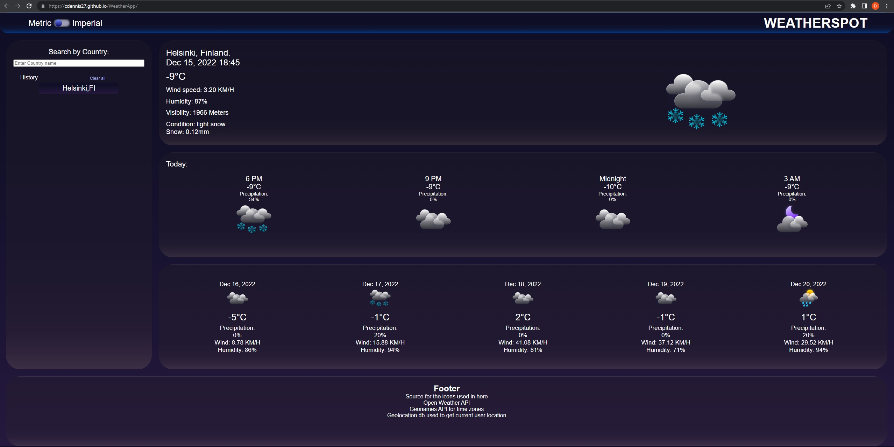

# Weather app for the weather conditions when and where you need! 

## Description

Simple code for a Weather conditions and time using interactive API's based on guidelines described on Challenge 6 Solo Project of University of Toronto Bootcamp.

Used few API's to get, current user location, city coordinates and weather conditions.

Utilized a CSS framework to optimze durability and prevent errors during application styling.

Stored on client-side storage most recent user city choices information for quick re-load and updates, with easy to use clear button.

## Table of Contents 

N/A

## Installation

N/A

## Link to deployed site: https://cdennis27.github.io/WeatherApp/

## Usage

Weather conditions search tool based on location.
Application will try to get users location and prompt current weather and forecast for that location at start.

Application has a search box asking for country name with a local database of countries and cities for quick and reliable autocomplete (database easily upgradeable).

After city choosen, app will save the city as a shortcut button and provide the weather and current date and time of that choosen location, if location not in the database, app will prompt user to choose another location.

Weather information displayed are the current weather, daily weather with 4 intervals and 5 day forecast for following days.

2 options of units used with toggle button on the top left between Metric or Imperial.

## Screenshots

## Link to Application

https://cdennis27.github.io/WeatherApp/

## Link to the GitHub repository

https://github.com/cdennis27/WeatherApp

### Credits

Lots of research on MDN website, youtube videos and StackOverflow was done to understand concepts used in this prototype. 

Referred in this applications the following API's and other sources:

    Weather API:
    
    https://openweathermap.org/

    Time Zone API:

    https://timezonedb.com/

    DayJS API:

    https://day.js.org

    Icons Design from:

    https://www.figma.com/community/file/1126777451931792118

    User location finder API:

    https://geolocation-db.com

### License

MIT License

Copyright (c) 2022 cdennis27

Permission is hereby granted, free of charge, to any person obtaining a copy
of this software and associated documentation files (the "Software"), to deal
in the Software without restriction, including without limitation the rights
to use, copy, modify, merge, publish, distribute, sublicense, and/or sell
copies of the Software, and to permit persons to whom the Software is
furnished to do so, subject to the following conditions:

The above copyright notice and this permission notice shall be included in all
copies or substantial portions of the Software.

THE SOFTWARE IS PROVIDED "AS IS", WITHOUT WARRANTY OF ANY KIND, EXPRESS OR
IMPLIED, INCLUDING BUT NOT LIMITED TO THE WARRANTIES OF MERCHANTABILITY,
FITNESS FOR A PARTICULAR PURPOSE AND NONINFRINGEMENT. IN NO EVENT SHALL THE
AUTHORS OR COPYRIGHT HOLDERS BE LIABLE FOR ANY CLAIM, DAMAGES OR OTHER
LIABILITY, WHETHER IN AN ACTION OF CONTRACT, TORT OR OTHERWISE, ARISING FROM,
OUT OF OR IN CONNECTION WITH THE SOFTWARE OR THE USE OR OTHER DEALINGS IN THE
SOFTWARE.

---END